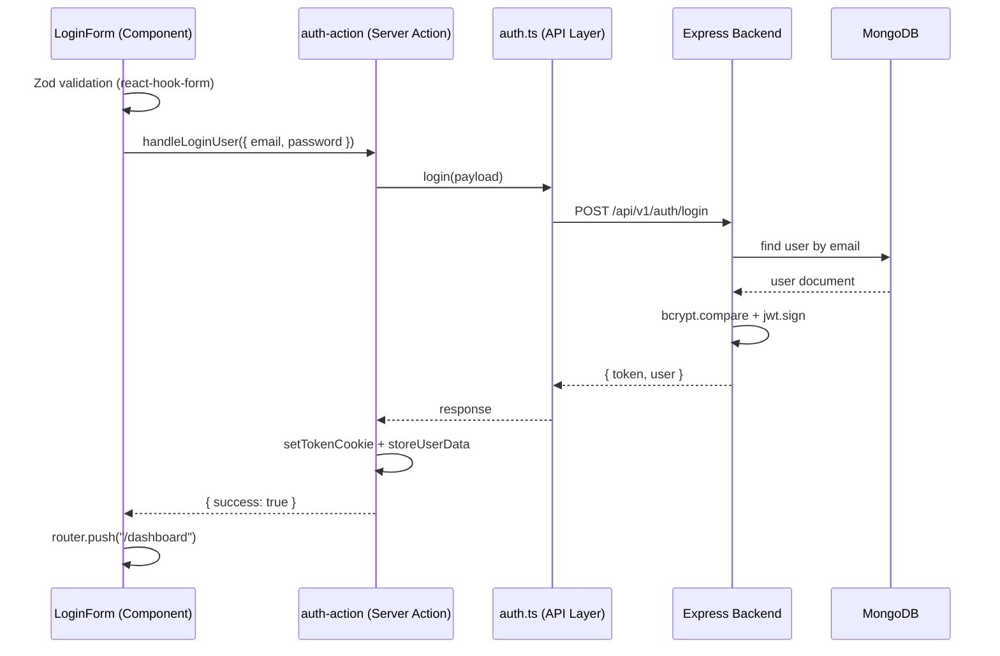

# Sprint 2 — Registration & Login Flow Walkthrough

This document explains how each layer of the project works, from HTTP request to database and back to the browser. Use it as a reference when presenting or submitting your assignment.

---

## Overview

| Side | Architecture | Flow |
|------|-------------|------|
| **Backend** | Layered (Route → Controller → Service → Repository → Model) | Client sends JSON → validated → business logic → MongoDB |
| **Frontend** | Component → Action → API | Form validates → server action → axios → backend → cookies → redirect |



---

## Backend Layers

### 1. Types — `backend/src/types/user.type.ts`

Defines the **shape of a user** using Zod. This is the single source of truth for validation rules.

| Field | Rule |
|-------|------|
| firstName, lastName | Required string |
| email | Valid email format |
| username | Min 3 characters |
| password | Min 6 characters |
| role | `admin` or `user` (default: `user`) |

`UserType` is inferred from the schema so TypeScript stays in sync with validation.

---

### 2. DTOs — `backend/src/dtos/user.dto.ts`

**DTO = Data Transfer Object.** Picks only the fields needed for each endpoint from `UserSchema`:

- **CreateUserDTO** — used for registration (`firstName`, `lastName`, `email`, `username`, `password`)
- **LoginUserDTO** — used for login (`email`, `password`)

This prevents clients from sending extra fields (like `role: "admin"`) during registration.

---

### 3. Model — `backend/src/models/user.model.ts`

The **Mongoose schema** that maps to a MongoDB collection.

- `email` and `username` are **unique**
- `password` is stored as a **hashed string** (never plain text)
- `role` defaults to `"user"`
- `timestamps: true` adds `createdAt` and `updatedAt` automatically

---

### 4. Repository — `backend/src/repositories/user.repository.ts`

Handles **all database access**. The service layer never talks to Mongoose directly.

| Method | Purpose |
|--------|---------|
| `findByEmail` | Lookup user for login / duplicate check |
| `findByUsername` | Duplicate check on registration |
| `findById` | Used by auth middleware |
| `create` | Save new user to MongoDB |

`IUserRepository` is an interface so the data layer could be swapped (e.g. in-memory for tests) without changing the service.

---

### 5. Service — `backend/src/services/user.service.ts`

Contains **business logic**. No HTTP concerns here — only rules and errors.

#### Registration (`createUser`)

1. Check if email already exists → throw `409 Email already in use`
2. Check if username already exists → throw `409 Username already in use`
3. Hash password with **bcrypt** (salt rounds: **10**)
4. Create user via repository with `role: "user"`
5. Return user **without password** (`omitPassword`)

#### Login (`loginUser`)

1. Find user by email → throw `401` if not found
2. Compare password with `bcrypt.compare` → throw `401` if invalid
3. Sign JWT with payload `{ id, email, role }`, expiry **30 days**
4. Return `{ token, user }` (user has no password field)

---

### 6. Controller — `backend/src/controllers/user.controller.ts`

The **HTTP layer**. Receives `req` / `res`, validates input, calls service, formats response.

1. Run `CreateUserDTO.safeParse(req.body)` or `LoginUserDTO.safeParse(req.body)`
2. On validation failure → `400` with error messages
3. Call `userService.createUser()` or `userService.loginUser()`
4. On `HttpException` → return matching status code and message
5. On success → `ApiResponseHelper.success(status, message, data)`

**Standard response shape:**

```json
{
  "status": 200,
  "success": true,
  "message": "Login successful",
  "data": { "token": "...", "user": { ... } }
}
```

---

### 7. Route — `backend/src/routes/user.route.ts`

Wires URL paths to controller methods and **dependency injection**:

```
UserMongoRepository → UserService → UserController
```

| Method | Path | Handler |
|--------|------|---------|
| POST | `/register` | `userController.register` |
| POST | `/login` | `userController.login` |

Mounted in `app.ts` at `/api/v1/auth`, so full URLs are:

- `POST http://localhost:8089/api/v1/auth/register`
- `POST http://localhost:8089/api/v1/auth/login`

---

### 8. App entry — `backend/index.ts` + `backend/src/app.ts`

- `index.ts` — connects to MongoDB, starts server on port **8089**
- `app.ts` — sets up CORS, JSON parsing, morgan logging, routes, and global error handler

---

## Frontend Layers

### 1. Schema — `frontend/app/(auth)/_components/schema.ts`

Client-side Zod validation **before** anything hits the server.

**Login:** `email` + `password` (min 6)

**Register:** all user fields + `confirmPassword`, with `.refine()` to ensure passwords match

---

### 2. Component — `LoginForm.tsx` / `RegisterForm.tsx`

Marked `"use client"` because they use hooks and browser APIs.

| Responsibility | How |
|----------------|-----|
| Form state | `react-hook-form` |
| Validation | `zodResolver(loginSchema)` |
| Loading state | `useTransition` → `isPending` |
| Submit | Calls server action, shows error banner on failure |
| Success (login) | `router.push("/dashboard")` |
| Success (register) | Redirect to `/login` after message |

**Assignment pattern:** Component does **not** call axios directly. It only calls the server action.

---

### 3. Server Action — `frontend/lib/actions/auth-action.ts`

Marked `"use server"`. Runs on the Next.js server, not in the browser.

**`handleRegisterUser`**
1. Calls `register()` from API layer
2. Returns `{ success, message, data }` to the form
3. Catches axios errors and maps backend `message` to the UI

**`handleLoginUser`**
1. Calls `login()` from API layer
2. On success → `setTokenCookie(token)` + `storeUserData(user)`
3. Returns result to the form (form handles redirect)

---

### 4. API Layer — `frontend/lib/api/`

| File | Role |
|------|------|
| `endpoints.ts` | Central list of API paths |
| `axios-instance.ts` | Base URL: `NEXT_PUBLIC_API_BASE_URL` or `http://localhost:8089` |
| `auth.ts` | `register()` and `login()` POST functions |

This keeps HTTP details out of components and actions.

---

### 5. Cookies — `frontend/lib/cookies.ts`

Marked `"use server"`. Manages auth session on the frontend.

| Cookie | Contents | Purpose |
|--------|----------|---------|
| `auth_token` | JWT string | Authentication token (httpOnly) |
| `user_data` | JSON string of user object | Display name on dashboard |

Both cookies: **httpOnly**, **sameSite: lax**, **30-day** max age.

---

### 6. Dashboard — `frontend/app/dashboard/page.tsx`

Server component (no `"use client"`).

1. Calls `getUserData()` from cookies
2. If no user → `redirect("/login")`
3. If user exists → render **"Welcome, {firstName}"**

This proves the full login → cookie → protected page flow works.

---

## End-to-End Flows

### Registration

```
/register page
  → RegisterForm validates with Zod
  → handleRegisterUser (server action)
  → POST /api/v1/auth/register
  → Controller validates CreateUserDTO
  → Service checks duplicates, hashes password
  → Repository saves to MongoDB
  → Response: user (no password)
  → UI shows success, redirects to /login
```

### Login

```
/login page
  → LoginForm validates with Zod
  → handleLoginUser (server action)
  → POST /api/v1/auth/login
  → Controller validates LoginUserDTO
  → Service verifies password, signs JWT
  → Response: { token, user }
  → Server action sets auth_token + user_data cookies
  → router.push("/dashboard")
  → Dashboard reads user_data → "Welcome, John"
```

---

## How to Demo for Your Assignment

1. **Start MongoDB** (must be running locally)
2. **Terminal 1:** `cd backend && npm run dev` → server on `:8089`
3. **Terminal 2:** `cd frontend && npm run dev` → app on `:3000`
4. Open `http://localhost:3000/register` → fill form → submit
5. Go to `/login` → sign in with same credentials
6. Land on `/dashboard` → see your first name

### What to highlight when presenting

| Requirement | Where to point |
|-------------|----------------|
| User Schema (Types, DTO, Mongoose) | `types/`, `dtos/`, `models/` |
| Email duplicate + password hashing | `user.service.ts` → `createUser` |
| Password verify + JWT | `user.service.ts` → `loginUser` |
| Layered backend | Route → Controller → Service → Repository → Model |
| Zod on frontend | `schema.ts` + `zodResolver` |
| Component → Action → API | `LoginForm` → `auth-action.ts` → `auth.ts` |
| Cookies + redirect | `cookies.ts` + `handleLoginUser` + dashboard |

---

## Environment Variables

**Backend** (`backend/.env`):
```
PORT=8089
MONGODB_URL=mongodb://localhost:27017/class-36a-db
SECRET_KEY=merosecretkey
```

**Frontend** (`frontend/.env.local`):
```
NEXT_PUBLIC_API_BASE_URL=http://localhost:8089
```

---

## File Map (quick reference)

```
backend/
├── index.ts                          # Start server + DB
├── src/
│   ├── app.ts                        # Express setup
│   ├── types/user.type.ts            # Zod UserSchema
│   ├── dtos/user.dto.ts              # CreateUserDTO, LoginUserDTO
│   ├── models/user.model.ts          # Mongoose IUser + schema
│   ├── repositories/user.repository.ts
│   ├── services/user.service.ts      # Register + login logic
│   ├── controllers/user.controller.ts
│   └── routes/user.route.ts

frontend/
├── app/
│   ├── (auth)/
│   │   ├── _components/
│   │   │   ├── schema.ts             # Zod form schemas
│   │   │   ├── LoginForm.tsx
│   │   │   └── RegisterForm.tsx
│   │   ├── login/page.tsx
│   │   └── register/page.tsx
│   └── dashboard/page.tsx
└── lib/
    ├── cookies.ts
    ├── actions/auth-action.ts
    └── api/
        ├── endpoints.ts
        ├── axios-instance.ts
        └── auth.ts
```
